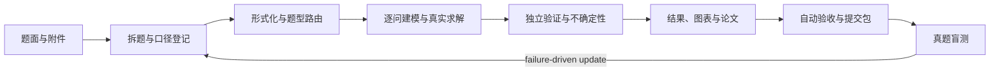

# CUMCM Modeling Skill

面向 CUMCM 国赛、MCM/ICM、研赛与其他数学建模竞赛的 Codex/Agent 全流程 Skill。它的目标不是只给出模型建议，而是把题面、数据、模型、可复现代码、真实结果、独立验证、论文和提交包连成一条可审计的证据链。

> 当前状态：**Alpha / 共同开发中**。工程架构已经完整，但历年真题覆盖与语义级验证远未完成。它不能保证答案正确，自动验收通过也不等于数学模型已被证明。

## 架构

```text
cumcm-modeling/
├── SKILL.md                 # 入口、触发语义、路由和反造假红线
├── AGENTS.md                # 工作区级规则镜像
├── rules/                   # 流程、交付、节奏、格式和迭代规则
├── 知识库/                  # 按题型路由的建模与求解模块
├── scripts/                 # 任务初始化、验收、提交打包
├── 评测/                    # 真题盲测协议与校准台账
└── references/              # 用户授权的外部规范和资料索引
```



### 1. 调度层：`SKILL.md`

负责判断竞赛语境、选择知识模块、定义交付标准，并强制区分 `official / assumption / synthetic-demo` 三级数据口径。入口只放全局决策，详细做法按需加载。

### 2. 控制层：`rules/`

负责从开题到提交的状态机：任务目录、进度落盘、两级路线设计、一问闭环、反停工、论文格式、经验回写和竞赛时间管理。

### 3. 建模层：`知识库/`

以 `modeling-core.md` 为公共形式化入口，再路由到数据清洗、评价、预测、优化、统计、机器学习、微分方程、数值 PDE、图论、仿真、信号、空间、控制、不确定性、结果检验、绘图和摘要等模块。

### 4. 执行层：`scripts/`

- `init_task.py`：初始化标准任务根目录。
- `verify_task.py`：检查目录结构、代码语法、CSV 异常、数字溯源、匿名与 PDF 交付等项目。
- `package_submission.py`：按规则生成提交包和校验信息。

### 5. 校准层：`评测/`

用公开历年题做时间隔离的盲测，不只看论文是否完整，还检查审题、变量与约束、信息泄漏、可复现性、独立验证、不确定性和结论边界。失败样例只在能归纳为可复用检查时才回写 Skill。

## 架构优势

1. **以可验证交付为终点**：要求每问真实运行、真实出数、真实出图，并能追溯到代码与结果文件。
2. **渐进加载**：入口、规则、题型知识和外部资料分层，避免每道题把整个知识库全部塞入上下文。
3. **一问闭环**：每个小问在建模、编码、出数、验证和进草稿后才算完成，减少“论文已写、数字还没有”的断层。
4. **反造假和证据边界**：禁止编数、伪代码、演示数据冒充正式结果和不存在的文献。
5. **题型覆盖广**：同一路由层可组合数据、机理、优化、仿真、空间、信号和控制等多类模型。
6. **具备失败驱动迭代机制**：盲测卡点需经过可复用性、重要性和放置位置审查，避免把单题细节无限堆成通用规则。

## 当前局限

1. **还不是“训练好的数模模型”**：本仓库主要是 Skill 指令、知识模块和确定性工具，没有包含经过全量历年题微调的模型权重。
2. **真题覆盖太少**：目前只有极少数题目的盲测经验，A/B/D/E、博弈、信号、空间、控制等能力线不能声称已稳定。
3. **自动验收主要是工程级**：它能发现缺文件、NaN/Inf、语法错误和数字不一致，但尚不能可靠地发现公式抄错、单位语义错、边界条件符号错和停机判据误读。
4. **数学验证尚未系统化**：不同题型需要不同的对拍、极端情形、单位、守恒、收敛、回测和可识别性检查，当前仍较依赖执行 Agent 的专业判断。
5. **质量受基础模型和工具环境影响**：PDF 公式解析、OCR、求解器、依赖库、计算资源与上下文限制都可能改变实际能力。
6. **当届真题不是可靠的训练集**：容易造成时间泄漏、过拟合和竞赛合规风险。能力评估应优先使用已结束且可合法获取的历年题。
7. **数据与版权尚未治理**：历年题、附件、获奖论文和第三方解析不应未经授权直接打包进公开仓库。

## 历年真题清洗与训练路线

本项目所说的“训练”首先指**真题语料清洗 + 隔离盲测 + 失败归因 + Skill 小步回写**，而不是简单把 PDF 全部堆给模型或立即微调权重。

### Phase 1：数据源盘点与授权

- 按竞赛、年份、题号、题型、附件类型、来源 URL、获取日期、许可/使用边界建立 manifest。
- 公开仓库默认只提交允许再分发的原文；不确定时仅提交元数据、校验和获取脚本。
- 获奖论文与第三方题解需单独记录版权与授权，不得把未授权内容当成训练数据公开。

### Phase 2：清洗和结构化

每道题至少生成以下结构化字段：

- 题面原文与页码映射；
- 公式 LaTeX、变量、上下标、分数结构与单位；
- 附件表结构、类型、缺失、异常、时间/空间粒度和数据口径；
- 逐问的输入、输出、约束、依赖、终止条件和提交格式；
- 题型标签与可选模型族，但不把某篇获奖论文当成唯一标答；
- 已知易错点、可执行验证器和评分 rubric。

清洗时必须保留原文快照与 checksum，并对 PDF 文本提取和页面图像做双路对照，特别检查分数、根号、负号、指数、上下标和单位。

### Phase 3：时间隔离评测

- 按年份切分开发集、验证集和隐藏测试集，禁止同年同题的解析泄漏到测试上下文。
- 按 A 机理、B 离散优化、C 数据、评价、预测、仿真、信号、空间、控制等能力线分层抽样。
- 不以“论文写完”为通过；优先评估题意忠实、约束完整、结果可复现、数学正确、误差可量化和结论不越界。

### Phase 4：语义验证器

优先共建以下可执行检查：

- PDF 公式与代码 AST/符号表转录对照；
- 单位、数量纲、温标和时间粒度检查；
- 约束、边界条件、事件方向与终止判据对照；
- 解析特例、小规模穷举、双求解器对拍、守恒量和网格/步长收敛；
- Excel 模板的时间范围、距离范围、sheet、精度和空值语义检查。

### Phase 5：学习与发布

- 先将失败归纳为最小、可执行、可跨题复用的规则或测试。
- 只有在检索增强、结构化示例和确定性验证仍不足时，才评估有监督微调或偏好训练。
- 任何权重训练都必须单独记录语料权利、去重、切分、泄漏检查和回归基准。

## 安装

```bash
git clone https://github.com/miaodaxia80-droid/cumcm-modeling-skill.git ~/.codex/skills/cumcm-modeling
```

或将本目录链接到你的 Agent Skill 搜索路径。安装后可以用“帮我做这道数模题”、“审查这篇 CUMCM 论文”等竞赛语境触发。

## 验证 Skill

```bash
python3 ~/.codex/skills/.system/skill-creator/scripts/quick_validate.py .
python3 scripts/init_task.py --help
python3 scripts/verify_task.py --help
python3 scripts/package_submission.py --help
```

## 共同开发

欢迎通过 Issue 提交真题失败案例、新题型、验证器需求与评测建议，通过 Pull Request 提交可复现修复。贡献前请阅读 [CONTRIBUTING.md](CONTRIBUTING.md)。

## 许可证

代码和原创文档以 [MIT License](LICENSE) 发布。题面、附件、论文和第三方材料仍归其原权利人所有，不因出现在 Issue、测试或本地语料中而改变许可边界。
