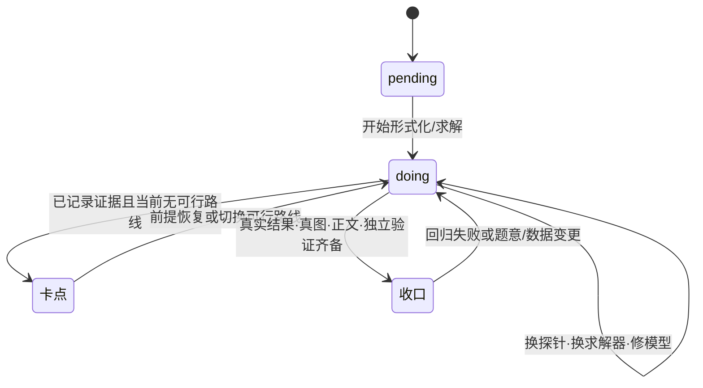

# CUMCM Modeling Skill

面向 CUMCM 国赛、MCM/ICM、研赛与其他数学建模竞赛的 Codex/Agent 全流程 Skill。它的目标不是只给出模型建议，而是把题面、数据、模型、可复现代码、真实结果、独立验证、论文和提交包连成一条可审计的证据链。

> 当前状态：**Alpha / 共同开发中**。工程架构已经完整，但历年真题覆盖与语义级验证远未完成。它不能保证答案正确，自动验收通过也不等于数学模型已被证明。

## 架构

这个仓库不是“一篇很长的 prompt”，而是一个分层的竞赛解题系统。架构上把五类职责分开：

1. **触发与路由**：什么时候进入数模流程，当前问应读哪个模块。
2. **流程与状态**：任务如何开始、续跑、逐问收口、终检和打包。
3. **建模与求解知识**：面对不同问题类型如何建模、选算法、做检验。
4. **确定性执行**：把重复且容易出错的目录、验收和打包动作固化为脚本。
5. **能力校准**：用隔离的历史真题检查真实表现，再将可复用失败回写。

这种拆分让“做题时需要的指令”与“维护者需要的完整文档”不必同时进入 Agent 上下文。

### 顶层目录和单一职责

```text
cumcm-modeling/
├── SKILL.md
│   ├── YAML frontmatter       # Skill 名称、发现描述和触发语义
│   ├── 全局红线             # 反编数、反伪代码、反假文献
│   ├── 题型路由表           # 题目信号 → 知识模块
│   └── 阶段概览与交付定义
├── AGENTS.md                  # 工作区环境的便捷镜像，不是规则真源
├── rules/
│   ├── contest-workflow.md     # Phase 0~6 主流程和“收口”唯一定义
│   ├── task-folder.md          # 任务根目录和文件归属契约
│   ├── modeling-value.md       # 得分优先级与完成度判断
│   ├── paper-format.md         # 论文、摘要、图表和引用格式真源
│   ├── anti-stall.md           # 不空转、卡点换路和续跑规则
│   ├── iter-gain.md            # 失败经验进库/补库门槛
│   ├── skill-as-boost.md       # Skill 是增强而非能力上限
│   └── contest-context.md      # 竞赛语境边界
├── 知识库/
│   ├── modeling-core.md        # 每问必过的形式化与复杂度闸
│   ├── 打穿短表.md            # 题型信号到模块的轻量索引
│   ├── data/eval/predict       # 数据清洗、评价、预测
│   ├── op/stat/ml             # 优化、统计、机器学习
│   ├── diff/numerical/phys    # 微分方程、数值模型、物理几何
│   ├── graph/sim              # 图论与仿真
│   ├── signal/spatial/control # 信号、空间、控制与序列决策
│   ├── uncertainty/result     # 不确定性、可识别性和结果检验
│   └── plot/abstract/paper     # 图表、摘要和论文骨架
├── scripts/
│   ├── init_task.py            # 创建标准任务根
│   ├── verify_task.py          # 工程级自动验收
│   └── package_submission.py   # 组装 PDF、支撑材料和校验信息
├── 评测/
│   └── 盲测协议.md            # 能力线、rubric、通过标准和校准台账
├── references/
│   └── README.md               # 外部规范/资料的使用边界，默认不加载原文
├── README.md                    # 仓库架构、能力边界和路线图
└── CONTRIBUTING.md              # 真题、数据、验证器和 PR 的贡献契约
```

> 树中的 `data/eval/predict` 等是对应 `data-cleaning.md`、`eval-models.md`、`predict-models.md` 的分组简写，实际文件清单见 [`知识库/README.md`](知识库/README.md)。

### 运行时数据流和控制流

```mermaid
flowchart TB
    U[用户指令 + 题面 + 附件]

    subgraph Router[调度面]
        S[SKILL.md<br/>语境判断·模式选择·模块路由]
    end

    subgraph Control[控制面]
        W[contest-workflow<br/>Phase 0~6]
        P[进度.md<br/>逐问状态·口径·依赖·卡点]
        R[rules<br/>目录·格式·得分·迭代]
    end

    subgraph Knowledge[建模面]
        M[modeling-core<br/>形式化·可识别性·复杂度闸]
        K[按题型加载的知识模块]
        V[result-check<br/>独立验证·不确定性]
    end

    subgraph Workspace[任务工作区]
        Q[题目/<br/>只读原件]
        D[数据/<br/>可再生清洗数据]
        C[代码/<br/>真实运行与环境说明]
        O[结果/q{i}/<br/>CSV·summary·figs]
        T[论文/<br/>草稿·终稿源·PDF]
        B[提交/<br/>PDF·MD5·支撑材料]
    end

    subgraph Tooling[执行与校准面]
        X[scripts<br/>初始化·验收·打包]
        E[历史真题盲测]
        G[可复用失败回写]
    end

    U --> S --> W
    W <--> P
    W --> M --> K --> C
    U --> Q --> D --> C --> O --> T --> B
    K --> V --> O
    R --> W
    X --> Workspace
    B --> E --> G
    G -. 只回写跨题根因 .-> R
    G -. 新模型知识 .-> K
    G -. 可执行机械检查 .-> X
```

图中有两条不同的链：

- **控制流**：`SKILL.md → rules → 进度.md → 当前未收口问`，决定下一步应该做什么。
- **数据/证据流**：`题目原件 → 清洗数据 → 代码 → 结果 → 论文 → 提交包`，决定每个数字能否回溯。

两条链只在“收口”节点汇合：进度状态不能靠文本声称更新，必须由已落盘的代码、结果、图和独立验证证据支撑。

### 运行时加载顺序

Skill 采用渐进加载，而不是每道题通读所有文件：

| 阶段 | 加载内容 | 解决的问题 |
|---|---|---|
| 0. 发现 | `SKILL.md` frontmatter | 这是否是数模竞赛任务？ |
| 1. 入口 | `SKILL.md` 正文 | 用什么模式、守哪些红线、交付到哪一层？ |
| 2. 开局 | `rules/contest-workflow.md` + `知识库/打穿短表.md` | 怎么拆题、排依赖、定粗路线？ |
| 3. 单问形式化 | `知识库/modeling-core.md` | 这一问究竟是预测、解释、控制还是决策？参数可识别吗？ |
| 4. 按题型加载 | 一个或数个匹配的知识模块 | 具体怎么建模、求解、做基线和识别失败？ |
| 5. 收口 | `result-check.md` + 该问相关模块 | 有没有 sanity check、独立证据和可量化误差？ |
| 6. 成文 | `abstract-writing.md` + `paper-template.md` + `paper-format.md` | 怎么把真实结果写成竞赛论文？ |
| 7. 交付 | `verify_task.py` + `package_submission.py` | 结构、数字溯源、匿名、PDF 和支撑包是否齐备？ |
| 8. 维护 | `评测/盲测协议.md` + `rules/iter-gain.md` | 这次失败是单题特例，还是值得进入通用 Skill？ |

`references/` 不在默认加载链中。只有用户点名某份规范、当年格式或外部资料时，才读取对应文件。

### 任务工作区契约

Skill 仓库本身只存放方法和工具；每道真题在仓库外拥有独立任务根：

```text
{题号/主题}_数模竞赛/
├── README.md                 # 任务说明，续跑入口
├── 进度.md                   # 模式、口径、粗路线、状态、依赖、卡点
├── 题目/                     # PDF、截图和原始附件；只读
├── 数据/                     # 可由代码重建的清洗/派生数据
├── 代码/                     # 分问脚本、公共模块、依赖和运行顺序
├── 结果/
│   └── q{i}/
│       ├── result_q{i}.*       # 机器可读真实数字
│       ├── summary_q{i}.md     # 该问的关键数字与口径
│       └── figs/               # 由真实结果生成的图
├── 论文/                     # 草稿、终稿源文件和编译 PDF
└── 提交/                     # 最终 PDF、MD5、支撑材料与清单
```

三类对象必须物理分离：

- `题目/` 是不改写的原始证据；
- `数据/` 是可再生的清洗与特征中间件；
- `结果/` 是论文数字的唯一计算来源。

这样可以避免原附件被清洗脚本覆盖、中间数据被当成结果，或论文中出现无法重算的孤立数字。

### 逐问状态机

`进度.md` 不是普通笔记，而是跨回合续跑的最小状态存储。每问只有四种状态：



“收口”不是求解器返回 success，也不是代码没报错。它要求该问同时具备：

- 题目要求的全部输出；
- 真实运行产生的结果文件；
- 由结果生成的图；
- 已进入论文草稿的数字与解释；
- 至少一项与主计算不同源的验证证据，或明确说明为何 N/A；
- `official / assumption / synthetic-demo` 口径标记。

### 规则优先级与真源

为避免同一规则在多个文件里漂移，架构定义了明确的真源：

| 冲突类型 | 优先采用 |
|---|---|
| 用户当次明确要求 vs Skill 默认 | 用户当次要求 |
| 当年官方格式/提交规范 vs 内置默认 | 当年官方文件 |
| 论文格式的重复说明 | `rules/paper-format.md` |
| 阶段、收口和推进节奏 | `rules/contest-workflow.md` |
| 任务目录与文件归属 | `rules/task-folder.md` |
| 具体模型怎么建和验证 | `知识库/` 对应模块 |
| `AGENTS.md` vs `rules/` | `rules/` 是真源，`AGENTS.md` 只做镜像 |

知识模块只回答“怎么建这个模型”，不重新定义“要不要做”、“什么算完成”或“论文怎么排版”。

### 证据契约与验证边界

架构将结果可信度分为三层：

| 层 | 问题 | 主要机制 |
|---|---|---|
| 工程完整性 | 文件在吗？代码能解析吗？结果有 NaN 吗？数字能溯源吗？ | `verify_task.py` |
| 数值/统计可信性 | 解收敛吗？有泄漏吗？误差和区间如何？ | `result-check.md` + 题型模块 |
| 题意与数学正确性 | 公式、单位、约束、边界、判据和结论真的对吗？ | 独立审题、语义验证器和历史盲测 |

`verify_task.py` 只是第一层的闸门。它通过不能推出后两层通过；这也是仓库将 `评测/` 与 `scripts/` 分开的原因。

### 扩展点

新能力按它改变的职责进入对应层：

| 变更 | 放置位置 | 不应做什么 |
|---|---|---|
| 新题型或新模型族 | `知识库/<module>.md`，并在 `SKILL.md` 路由表增加一个入口 | 把整篇方法塞入 `SKILL.md` |
| 跨题的推进/交付规则 | `rules/` 的对应真源 | 同时复制到多个文件 |
| 重复、可确定执行的机械动作 | `scripts/`，并留一个最小可运行检查 | 为一次性任务新建框架 |
| 真题失败和能力声称 | `评测/`，通过 `iter-gain.md` 审查后再回写 | 把单题数值或答案当通用知识 |
| 当年官方规范或用户资料 | `references/`，按需加载 | 默认把所有外部资料注入上下文 |

这个分层也给共同开发提供了比较稳定的边界：模型贡献者主要改知识库，工具贡献者主要改脚本，评测贡献者主要改盲测与验证器，不需要为一个局部能力改写整个 Skill。

## 架构优势

1. **以可验证交付为终点**：要求每问真实运行、真实出数、真实出图，并能追溯到代码与结果文件。
2. **渐进加载**：入口、规则、题型知识和外部资料分层，避免每道题把整个知识库全部塞入上下文。
3. **一问闭环**：每个小问在建模、编码、出数、验证和进草稿后才算完成，减少“论文已写、数字还没有”的断层。
4. **反造假和证据边界**：禁止编数、伪代码、演示数据冒充正式结果和不存在的文献。
5. **题型覆盖广**：同一路由层可组合数据、机理、优化、仿真、空间、信号和控制等多类模型。
6. **具备失败驱动迭代机制**：盲测卡点需经过可复用性、重要性和放置位置审查，避免把单题细节无限堆成通用规则。

## 当前局限

1. **还不是“训练好的数模模型”**：本仓库主要是 Skill 指令、知识模块和确定性工具，没有包含经过全量历年题微调的模型权重。
2. **真题覆盖太少**：目前只有极少数题目的盲测经验，A/B/D/E、博弈、信号、空间、控制等能力线不能声称已稳定。
3. **自动验收主要是工程级**：它能发现缺文件、NaN/Inf、语法错误和数字不一致，但尚不能可靠地发现公式抄错、单位语义错、边界条件符号错和停机判据误读。
4. **数学验证尚未系统化**：不同题型需要不同的对拍、极端情形、单位、守恒、收敛、回测和可识别性检查，当前仍较依赖执行 Agent 的专业判断。
5. **质量受基础模型和工具环境影响**：PDF 公式解析、OCR、求解器、依赖库、计算资源与上下文限制都可能改变实际能力。
6. **当届真题不是可靠的训练集**：容易造成时间泄漏、过拟合和竞赛合规风险。能力评估应优先使用已结束且可合法获取的历年题。
7. **数据与版权尚未治理**：历年题、附件、获奖论文和第三方解析不应未经授权直接打包进公开仓库。

## 历年真题清洗与训练路线

本项目所说的“训练”首先指**真题语料清洗 + 隔离盲测 + 失败归因 + Skill 小步回写**，而不是简单把 PDF 全部堆给模型或立即微调权重。

### Phase 1：数据源盘点与授权

- 按竞赛、年份、题号、题型、附件类型、来源 URL、获取日期、许可/使用边界建立 manifest。
- 公开仓库默认只提交允许再分发的原文；不确定时仅提交元数据、校验和获取脚本。
- 获奖论文与第三方题解需单独记录版权与授权，不得把未授权内容当成训练数据公开。

### Phase 2：清洗和结构化

每道题至少生成以下结构化字段：

- 题面原文与页码映射；
- 公式 LaTeX、变量、上下标、分数结构与单位；
- 附件表结构、类型、缺失、异常、时间/空间粒度和数据口径；
- 逐问的输入、输出、约束、依赖、终止条件和提交格式；
- 题型标签与可选模型族，但不把某篇获奖论文当成唯一标答；
- 已知易错点、可执行验证器和评分 rubric。

清洗时必须保留原文快照与 checksum，并对 PDF 文本提取和页面图像做双路对照，特别检查分数、根号、负号、指数、上下标和单位。

### Phase 3：时间隔离评测

- 按年份切分开发集、验证集和隐藏测试集，禁止同年同题的解析泄漏到测试上下文。
- 按 A 机理、B 离散优化、C 数据、评价、预测、仿真、信号、空间、控制等能力线分层抽样。
- 不以“论文写完”为通过；优先评估题意忠实、约束完整、结果可复现、数学正确、误差可量化和结论不越界。

### Phase 4：语义验证器

优先共建以下可执行检查：

- PDF 公式与代码 AST/符号表转录对照；
- 单位、数量纲、温标和时间粒度检查；
- 约束、边界条件、事件方向与终止判据对照；
- 解析特例、小规模穷举、双求解器对拍、守恒量和网格/步长收敛；
- Excel 模板的时间范围、距离范围、sheet、精度和空值语义检查。

### Phase 5：学习与发布

- 先将失败归纳为最小、可执行、可跨题复用的规则或测试。
- 只有在检索增强、结构化示例和确定性验证仍不足时，才评估有监督微调或偏好训练。
- 任何权重训练都必须单独记录语料权利、去重、切分、泄漏检查和回归基准。

## 安装

```bash
git clone https://github.com/miaodaxia80-droid/cumcm-modeling-skill.git ~/.codex/skills/cumcm-modeling
```

或将本目录链接到你的 Agent Skill 搜索路径。安装后可以用“帮我做这道数模题”、“审查这篇 CUMCM 论文”等竞赛语境触发。

## 验证 Skill

```bash
python3 ~/.codex/skills/.system/skill-creator/scripts/quick_validate.py .
python3 scripts/init_task.py --help
python3 scripts/verify_task.py --help
python3 scripts/package_submission.py --help
```

## 共同开发

欢迎通过 Issue 提交真题失败案例、新题型、验证器需求与评测建议，通过 Pull Request 提交可复现修复。贡献前请阅读 [CONTRIBUTING.md](CONTRIBUTING.md)。

## 许可证

代码和原创文档以 [MIT License](LICENSE) 发布。题面、附件、论文和第三方材料仍归其原权利人所有，不因出现在 Issue、测试或本地语料中而改变许可边界。
